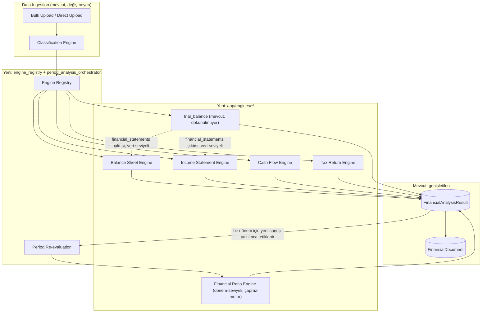

# FINOS Milestone 4 — Financial Statement Intelligence Engine
## Mimari Tasarım Dokümanı (Onay Bekliyor — Implementasyon Başlamadı)

Branch: `feature/financial-statement-engine`
Durum: **Sadece analiz ve tasarım.** Hiçbir dosya değiştirilmedi, hiçbir migration yazılmadı, hiçbir commit oluşturulmadı.

---

## Bölüm A — Mevcut Sistemin Analizi

### A.1 Mevcut veri modeli

Sistem şu an 6 tabloya sahip (3 migration: `94c5e7403385` → `1f0e6d51f21b`/`2b6a8f4c9d31` → `9d4f1a7c6e52`):

| Tablo | Rol | Kritik kısıt |
|---|---|---|
| `companies` | Firma | `tax_number` unique |
| `financial_periods` | Mali dönem | `(company_id, year, period_type, period_number)` unique; `(id, company_id)` unique — alt composite FK'lerin hedefi |
| `financial_documents` | Yüklenen kaynak belge (metadata) | `(company_id, period_id)` composite FK'si `financial_periods.(id, company_id)`'ye karşı — döküman-dönem-firma tutarsızlığı DB seviyesinde imkansız; `(period_id, checksum)` unique — aynı dönemde aynı belge iki kez yok |
| `financial_analysis_results` | Bir motorun bir belge üzerindeki çalışma sonucu | `(document_id, company_id, period_id)` composite FK'si `financial_documents.(id, company_id, period_id)`'ye karşı — Company/Period'a DOĞRUDAN FK yok, tutarlılık zaten belge zinciri üzerinden garanti; `result_json` JSON/JSONB |
| `bulk_upload_batches` | Toplu yükleme oturumu | `status`: processing/completed/failed/**confirmed** (terminal, immutable) |
| `bulk_upload_items` | Batch içindeki tek dosyanın sınıflandırma + inceleme + sonuç izi | `resolution_json` (taslak), `resulting_*_id` (yalnızca confirm sonrası dolar, audit izi) |

**En kritik gözlem — `FinancialAnalysisResult` zaten motor-agnostik tasarlanmış:** Tablo `analysis_type` (bugün yalnızca `trial_balance`) ve serbest biçimli `result_json` içeriyor. Yeni bir motor eklemek bugünkü şema ile **yeni tablo gerektirmiyor** — yalnızca `AnalysisType` enum'ına yeni değer eklemek yeterli. Bu, Milestone 4'ün en büyük yeniden-kullanılabilir varlığı.

**Enum'larda zaten var olan ama kullanılmayan potansiyel:** `DetectedDocumentType` (sınıflandırma motorunun tahmin edebildiği türler) bugün 5 değere sahip: `trial_balance`, `corporate_tax_return`, `temporary_tax_return`, `balance_sheet`, `income_statement`. Yani sınıflandırma motoru Balance Sheet ve Income Statement'ı **zaten tespit edebiliyor** — ama gerçek `DocumentType` (kalıcı belge türü) yalnızca 4 kaba kategoriye sahip: `trial_balance`, `tax_declaration`, `financial_statement`, `other`. `app/services/bulk_upload.py`'deki `DETECTED_TO_DOCUMENT_TYPE` eşleme tablosu 5 tahmini 4 kaba türe indirgiyor — `balance_sheet` ve `income_statement` ikisi de `financial_statement` olarak, `corporate_tax_return`/`temporary_tax_return` ikisi de `tax_declaration` olarak kaydediliyor. Bu bilgi kaybı bugün zararsız (henüz bu türler için motor yok) ama Milestone 4'te motor-başına ayrım gerekeceği için giderilmesi gereken bir kısıt.

**Eksik olan tek DetectedDocumentType: Cash Flow Statement.** `app/classification/document_classifier.py`'deki `PDF_KEYWORD_RULES`/`FILENAME_KEYWORD_RULES` tablolarında "nakit akış tablosu" için hiçbir kural yok, enum'da karşılığı da yok. Milestone 4'ün Cash Flow Engine'i için bu tespit katmanının genişletilmesi gerekiyor.

### A.2 Mevcut servis katmanı

İki farklı orkestrasyon deseni bir arada yaşıyor:

1. **Doğrudan tekli yükleme** (`app/services/trial_balance_upload.py` + `POST /periods/{period_id}/trial-balances`): iki-aşamalı commit — önce `FinancialDocument`+`FinancialAnalysisResult` `PROCESSING` durumunda yazılıp commit edilir, motor transaction DIŞINDA çalışır, sonuca göre ikinci bir transaction ile `COMPLETED`/`FAILED`'e güncellenir. Yarım kalan durumda bile "PROCESSING'te kaldı" diye bir audit kaydı her zaman kalıcı.
2. **Toplu yükleme onayı** (`app/services/bulk_upload.py` confirm akışı, Milestone 3): üç-fazlı, TAMAMI-YA-DA-HİÇ — FAZ 1 (DB'den okuma, ön-doğrulama, TÜM hataları toplar), FAZ 2 (saf bellek içi motor çağrıları, `db` parametresi YOK), FAZ 3 (tek transaction, tüm accepted item'lar için Company/Period/Document/Analysis find-or-create + yazma, tek commit, herhangi bir hatada tam rollback).

Bu iki desen **kavramsal olarak aynı işi** ("bir belge üzerinde bir motor çalıştır, sonucu kalıcı hale getir") farklı tutarlılık garantileriyle yapıyor. Bugüne kadar zararı yok çünkü yalnızca `trial_balance` motoru var ve her iki yol da ona hardcoded çağrı yapıyor (`app/trial_balance/service.py::analyze_trial_balance`).

**Motor dispatch bugün hardcoded, registry değil:**
```
CONTENT_REQUIRED_DETECTED_TYPES = frozenset({DetectedDocumentType.TRIAL_BALANCE})
```
`_run_confirm_analyses` yalnızca `detected_document_type == TRIAL_BALANCE` olan item'lar için `analyze_trial_balance` çağırıyor; diğer türler (`balance_sheet`, `corporate_tax_return` vb.) için `FinancialDocument` oluşturuluyor ama **hiçbir analiz çalıştırılmıyor**, `processing_status=PENDING` kalıyor. Bu, Milestone 4'ün tam olarak dolduracağı boşluk.

### A.3 Mevcut analiz motorları (`app/trial_balance/**` — DOKUNULMAYACAK)

Motor tamamen saf/stateless, sqlalchemy'ye hiç bağımlı değil (yalnızca `pandas`), şu boru hattını izliyor:

```
parsers/generic.py (satır ayrıştırma, Numeric/Decimal)
  → column_detector.py (Türkçe kolon adı eşanlamlıları)
  → structure_detector.py (hiyerarşik mi düz mü hesap planı?)
  → account_tree.py (kod ayracına göre parent/leaf tespiti, keyfi derinlik)
  → financial_statements.py (Tekdüzen Hesap Planı sınıf öneki eşlemesi: 1/2/3/4/5 → bilanço bölümleri, 60-69 → gelir tablosu bölümleri)
  → ratios.py (likidite/kaldıraç/kârlılık/kapsama oranları, float+safe_divide)
  → insights.py (deterministik kural tabanlı bulgu üretimi — eksik veri asla sıfır varsayılmaz, null bırakılır)
```

**Kritik mimari gerçek:** Bu motor, bir mizan (trial balance) yüklendiğinde **zaten** tam bir bilanço + gelir tablosu + oran seti + bulgu seti üretiyor (`build_financial_statements`, `build_ratios`, `build_insights`). Bunun nedeni Türk Tekdüzen Hesap Planı pratiğinde mizanın, hem bilanço hem gelir tablosunun kaynağı olması. Bu, Milestone 4'ün "Balance Sheet Engine" ve "Income Statement Engine" isteğiyle **kavramsal olarak örtüşüyor** — Bölüm B.9'da bu örtüşmenin nasıl ele alınacağı ayrıntılı tartışılıyor (bu, dokümandaki en önemli mimari karar noktasıdır).

### A.4 Mevcut API yapısı

REST yüzeyi (tamamı `/api/v1` altında, `main.py`'de router olarak toplanıyor):

| Router | Rotalar | Not |
|---|---|---|
| `companies.py` | `POST/GET /companies`, `GET /companies/{id}` | — |
| `periods.py` | `POST/GET /companies/{company_id}/periods`, `GET /periods/{id}` | — |
| `trial_balances.py` | `POST /periods/{period_id}/trial-balances` | Doğrudan tekli yükleme, motor-özel |
| `documents.py` | `GET /periods/{period_id}/documents`, `GET /documents/{id}`, `GET /documents/{id}/analyses` | Genel amaçlı okuma |
| `analyses.py` | `GET /analyses/{id}` | Genel amaçlı okuma |
| `bulk_uploads.py` | `POST /bulk-uploads`, `GET /bulk-uploads/{id}`, `GET .../items`, `PATCH .../items/{item_id}`, `PATCH .../items`, `POST .../confirm` | Milestone 2-3, en olgun akış |
| (main.py, legacy) | `POST /api/v1/trial-balance/validate` | **DOKUNULMAYACAK** — kalıcılaştırma yapmayan, saf motor-önizleme endpoint'i |

Pagination için tek bir paylaşılan `Page[T]` şeması var (`app/schemas/pagination.py`) — tutarlı, tekrar kullanılabilir.

### A.5 Mevcut migration zinciri

```
94c5e7403385 (initial: Company/FinancialPeriod/FinancialDocument)
  → 1f0e6d51f21b (FinancialAnalysisResult)
  → 2b6a8f4c9d31 (BulkUploadBatch/Item)
  → 9d4f1a7c6e52 (confirm alanları — bu oturumda 63-karakter FK adı hatası düzeltildi)
```

Naming convention `app/db/base.py`'de tek merkezden tanımlı (`NAMING_CONVENTION` dict), ama bu oturumda öğrenildiği gibi **uzun tablo/kolon adı kombinasyonlarında otomatik üretilen isim PostgreSQL'in 63 karakter sınırını aşabiliyor** — bu artık standart bir kontrol maddesi olmalı (bkz. Bölüm B.11).

### A.6 Mevcut test mimarisi

İki katmanlı, kasıtlı olarak farklı kapsamlarda:
- **SQLite testleri** (`test_*_api.py`): API sözleşmesi — status code, request/response şekli, iş kuralları. Docker/Postgres gerekmez, hızlı.
- **Gerçek Postgres entegrasyon testleri** (`test_*_postgres_integration.py`): composite FK, RESTRICT, unique/CHECK constraint, native JSONB doğrulaması. `TEST_DATABASE_URL` yoksa zarifçe `pytest.skip`.
- **Motor-seviyeli "gerçek çalıştırılabilir" testler** (`test_trial_balance_regression.py`, `test_classification_unit.py`): sqlalchemy/fastapi'ye bağımlı DEĞİL, yalnızca `pandas`/stdlib — bu sayede kısıtlı sandbox'larda bile gerçekten çalıştırılabiliyor. Sentetik, tamamen kurgusal fixture'lar (`tests/data/synthetic/`), gerçek/anonimleştirilmemiş veri asla yok.

### A.7 Dependency ilişkileri

```
app/api/v1/*        → app/services/*, app/schemas/*
app/services/*       → app/models/*, app/trial_balance/service.py, app/classification/*
app/classification/* → app/models/enums.py, app/trial_balance/column_detector.py (salt-okunur, tek fonksiyon)
app/trial_balance/**  → yalnızca pandas + stdlib (sqlalchemy YOK, app/models'e bağımlılık YOK)
app/models/*          → app/db/base.py, app/models/enums.py
```

`app/trial_balance/**`'in sıfır dışa bağımlılığı (sqlalchemy dahil) onu hem test edilebilir hem de "dokunulmaz çekirdek" olarak korunabilir kılıyor — bu izolasyon prensibi Milestone 4'teki yeni motorlar için de doğrudan örnek alınmalı.

### A.8 Tekrar kullanılabilecek kodlar

- `FinancialAnalysisResult` tablosu ve JSON/JSONB deseni (yeni tablo gerektirmeden yeni motor sonucu saklama).
- `app/schemas/pagination.py::Page[T]`.
- `_find_or_create_company`/`_find_or_create_period` (bulk_upload.py) — find-or-create + VKN/period reuse deseni.
- 3-fazlı confirm deseni (DB-oku → bellek-içi hesapla → tek-transaction-yaz) — DB kilidi tutmadan uzun süren hesaplama yapma prensibi, yeni motorlar için de geçerli olmalı.
- `BALANCE_SHEET_SECTIONS`/`INCOME_STATEMENT_SECTIONS` (Tekdüzen Hesap Planı numeric-prefix eşlemesi) — kavramsal olarak yeniden kullanılabilir ama **doğrudan import edilmemeli** (bkz. B.5 gerekçe).
- Sınıflandırma motorunun kural-tablosu deseni (`(anahtar_kelime, tür, confidence)` liste-of-tuple) — yeni belge türleri için genişletmesi kolay, kanıtlanmış.
- 2-katmanlı test stratejisi ve sentetik fixture üretim yöntemi.

### A.9 Genişletilmesi gereken yapılar

- `DocumentType` enum'ı (4 → en az 8 değer: mevcut + `corporate_tax_return`, `temporary_tax_return`, `balance_sheet`, `income_statement`, `cash_flow_statement`).
- `AnalysisType` enum'ı (1 → 6 değer: `trial_balance` + `balance_sheet`, `income_statement`, `cash_flow`, `tax_return`, `financial_ratios`).
- `DetectedDocumentType` enum'ı (+ `cash_flow_statement`).
- `app/classification/document_classifier.py`'deki kural tabloları (+ nakit akış anahtar kelimeleri).
- `DETECTED_TO_DOCUMENT_TYPE`/`CONTENT_REQUIRED_DETECTED_TYPES` — hardcoded dict'ten registry'ye.
- İki farklı orkestrasyon deseninin (tekli/toplu) ortak bir çekirdek etrafında birleştirilmesi (zorunlu değil ama önerilir, bkz. B.3).

### A.10 Potansiyel teknik borçlar

1. **Fiziksel dosya içeriği hâlâ hiçbir yerde saklanmıyor** (Milestone 3'ten devralınan, bilinçli, kayıtlı borç). Milestone 4'te belge sayısı ve tür çeşitliliği arttıkça (özellikle taranmış PDF beyannameler) bu borcun önceliği artıyor — nesne depolama (S3/MinIO) hâlâ ayrı bir milestone olarak öneriliyor, bu dokümanın kapsamı DIŞINDA.
2. **Global VKN bazlı Company lookup** (Milestone 3'ten kayıtlı, çok-kiracılı/tenant seam notu) — yeni motorlar Company'yi daha sık okuyacağı için önceliği yine artıyor, hâlâ ayrı milestone.
3. **İki paralel orkestrasyon deseni** (A.2) — birleştirilmezse her yeni motor ikisine de ayrı ayrı entegre edilmek zorunda kalabilir, kod tekrarı riski.
4. **PDF OCR desteği yok** — taranmış/görüntü tabanlı PDF'lerden metin çıkarılamıyor (`PDF_NO_EXTRACTABLE_TEXT` uyarısı ile zarifçe pes ediliyor). Kurumlar/Geçici Vergi Beyannameleri sıklıkla taranmış PDF olarak gelebiliyor — Tax Return Engine bu sınırla doğrudan karşılaşacak.
5. **`.xls` (`xlrd`) desteği kodda tam ama bu sandbox'ta hiç doğrulanamadı** — yerelde doğrulanması gereken, devam eden bir madde.

### A.11 Performans riskleri ve gelecekte oluşabilecek darboğazlar

1. Bir toplu yükleme onayı (`confirm`) tek bir HTTP isteği/transaction zarfı içinde en fazla `bulk_upload_max_files=20` dosya için FAZ 2'de motor(ları) senkron çalıştırıyor. Motor sayısı 1'den 6-7'ye çıkınca (bu milestone sonunda), aynı batch'te farklı türden belgeler varsa toplam FAZ 2 süresi doğrusal değil, motor-türü başına farklı maliyetle büyür — p95 gecikme izlenmeli.
2. Nakit Akış ve Oran motorları **dönem-seviyeli, çapraz-belge** çalışıyor (bkz. B.4) — bu, "bir belge → bir motor çağrısı" modelinden sapıyor ve yeniden-tetikleme (re-run) mantığı gerektiriyor; kontrolsüz büyürse fan-out riski taşır.
3. `result_json` JSONB alanları motor sayısı arttıkça satır başına önemli ölçüde büyüyecek (trial_balance'ın kendi çıktısı bile account-tree-preview + financial_statements + financial_ratios + financial_insights içeriyor) — bugün aksiyon gerekmiyor ama izlenmesi gereken bir büyüme eğilimi.
4. Taranmış PDF'ler için OCR eklenirse (bu milestone kapsamında değil) bu, senkron istek-yanıt döngüsüne sığmayacak kadar yavaş olabilir — ileride asenkron iş kuyruğu ihtiyacının en olası tetikleyicisi bu olacak.

---

## Bölüm B — Milestone 4 Mimari Tasarımı

### B.1 Tasarım felsefesi (mevcut blueprint ile hizalama)

`docs/FINOS_ARCHITECTURE_V1.md` bölüm 2'deki üç ilke bu tasarımın da temelini oluşturuyor ve hiçbiri esnetilmiyor:
- **Deterministik motor**: Yeni 5 motorun hiçbiri (Balance Sheet/Income Statement/Cash Flow/Tax Return/Ratio) yapay zekâ kullanmaz; tamamı kod-tabanlı, test edilebilir, tekrarlanabilir hesaplamalardır.
- **Kaynak izlenebilirliği**: Her yeni `FinancialAnalysisResult`, hangi belge(ler)den ve hangi motor sürümünden üretildiğini izlenebilir tutmalı (bkz. B.6 — bu ilke, dönem-seviyeli motorlar için şemada açık bir karar gerektiriyor).
- **Eksik veri yönetimi**: Bir motorun ihtiyaç duyduğu bağımlı belge/dönem yoksa, o motorun sonucu **eksik alanları null bırakır**, asla sıfır/varsayım üretmez — `insights.py`'deki mevcut disiplinin birebir devamı.

### B.2 En kritik karar noktası: motorlar neyi analiz ediyor?

Kullanıcı isteğinde "Balance Sheet Engine", "Income Statement Engine" vb. sanki her biri kendi başına yüklenen bir belgeyi analiz edecekmiş gibi tanımlanıyor. Ama A.3'te gösterildiği gibi, mevcut `trial_balance` motoru **zaten** bir bilanço + gelir tablosu üretiyor (mizandan türetilerek). Bu iki gerçeği uzlaştırmak için üç alternatif değerlendirildi:

**Alternatif 1 — Saf belge-merkezli (kullanıcının isteğinin en dar okunuşu):** Her motor yalnızca KENDİ türündeki doğrudan yüklenen belgeyi işler (ör. Balance Sheet Engine yalnızca yüklenen bir bilanço dosyasını okur). Mizandan türetilmiş bilanço/gelir tablosu ile hiç ilişkilendirilmez.
  - (–) Bir firma yalnızca mizan yüklediğinde (Türkiye'de en yaygın senaryo) Balance Sheet Engine hiç çalışmaz — kullanıcı değeri düşük.
  - (–) `trial_balance/financial_statements.py`'nin ürettiği veri ile yeni motorun ürettiği veri arasında iki paralel/tutarsız "bilanço" kavramı oluşur.

**Alternatif 2 — Tamamen kanonik-veri-merkezli:** Belge türü ne olursa olsun (mizan/doğrudan bilanço/vb.), her belge önce ortak bir "kanonik satır kalemi" temsiline (`BalanceSheetFacts`, `IncomeStatementFacts` vb.) dönüştürülür; motorlar yalnızca bu kanonik veriyi tüketir, hiçbir zaman ham dosyayla uğraşmaz.
  - (+) Tek doğruluk kaynağı, motor kodu dosya formatından tamamen izole.
  - (–) Büyük bir yeniden-yapılanma; `trial_balance/**`'e (dokunulmaması gereken) dolaylı bir kavramsal bağımlılık yaratma riski.

**Alternatif 3 (ÖNERİLEN) — Hibrit: motor-başına "extractor + analyzer" ayrımı, veri kaynağına göre iki mod:**
Her yeni motor iki alt bileşenden oluşur:
- **Extractor**: Ham dosyayı (o türün doğrudan yüklenmiş hâli — ör. gerçek bir bilanço PDF/Excel'i) kanonik bir fact/dict yapısına çevirir. Bu, `trial_balance` motorunun bugün yaptığına benzer ama YENİ ve BAĞIMSIZ kod — `trial_balance/**`'e hiç dokunmadan, hiç import etmeden.
- **Analyzer**: Kanonik fact yapısını (+ varsa önceki dönemin fact'lerini) girdi alıp istenen analizleri (Aktif/Pasif/Özkaynak/Likidite/Borçluluk/Sermaye yapısı vb.) üretir.

Motor, girdisini şu önceliğe göre bulur: **(a)** o dönem için doğrudan o türde bir belge yüklenmişse → extractor'ı çalıştır; **(b)** yoksa ve o dönem için bir `trial_balance` analiz sonucu VARSA → `trial_balance` motorunun zaten ürettiği `financial_statements` çıktısını (salt-okunur, `result_json` üzerinden — kod bağımlılığı değil, VERİ bağımlılığı) kanonik girdi olarak kullan; **(c)** ikisi de yoksa → o motor o dönem için hiç çalışmaz, `FinancialDocument.processing_status` `PENDING` kalır (mevcut davranışla birebir tutarlı).

Bu, `trial_balance/**` kod tabanına SIFIR dokunuş/bağımlılık sağlarken (yalnızca onun ürettiği KAYITLI SONUCU, bir başka motorun girdisi olarak okur — bu tamamen veri-seviyeli, DB üzerinden, herhangi bir import olmadan), hem "yalnızca mizan yükleyen" firmalar için hem de "gerçek bilanço/gelir tablosu belgesi yükleyen" firmalar için Balance Sheet/Income Statement Engine'in çalışmasını sağlar. **Bu doküman Alternatif 3'ü önerir.**

### B.3 Servis mimarisi



Yeni servis dosyaları (öneri, implementasyon aşamasında netleşecek):

- `app/services/engine_registry.py` — `DetectedDocumentType → EngineAdapter` eşlemesi. `EngineAdapter`: `analysis_type`, `requires_content: bool`, `run(content, filename, context) -> dict`. Bugünkü `DETECTED_TO_DOCUMENT_TYPE`/`CONTENT_REQUIRED_DETECTED_TYPES` hardcoded dict'lerinin yerini alır.
- `app/services/period_analysis_orchestrator.py` — bir (company, period) için hangi bağımlı motorların (Ratio, Cash Flow-derived) yeniden tetiklenmesi gerektiğini belirleyen paylaşılan mantık; hem bulk confirm hem doğrudan yükleme akışından çağrılır (A.10 madde 3'teki tekrarı önler).
- `app/services/bulk_upload.py` (MEVCUT, değiştirilecek): `_run_confirm_analyses`/`_write_confirmed_records` içindeki hardcoded `analyze_trial_balance` çağrısı → `engine_registry` üzerinden dispatch.
- `app/services/trial_balance_upload.py` (MEVCUT): dokunulmaz kalabilir VEYA (öneri, zorunlu değil) `engine_registry`'yi kullanan genel bir `document_upload.py`'ye evrilebilir — bu implementasyon aşamasında ayrıca kararlaştırılmalı.

### B.4 Motor-başına tasarım özeti

| Motor | Girdi modu | Bağımlılık | Çıktı (özet) |
|---|---|---|---|
| **Balance Sheet** | Doğrudan belge VEYA trial_balance sonucu (B.2) | Yok (tek dönem yeterli); trend analizi için önceki dönem OPSİYONEL | Aktif/Pasif/Özkaynak kırılımı, dikey analiz (%), yatay analiz (önceki dönem varsa), çalışma sermayesi, BS-türetilebilir oranlar (current ratio, debt ratio, equity ratio) |
| **Income Statement** | Doğrudan belge VEYA trial_balance sonucu | Yok | Gelir/COGS/Brüt Kâr/EBIT/EBITDA/Net Kâr, marj oranları |
| **Cash Flow** | Doğrudan belge (varsa, "direct" mod — daha güvenilir) VEYA dolaylı türetim ("derived" mod: 2 ardışık dönem BS + 1 dönem IS) | **Zorunlu**: derived modda önceki dönemin BS'i (mevcut değilse motor bu dönem için hiç çalışmaz, veri eksik notu ile) | Operating/Investing/Financing CF, Free Cash Flow, Cash Conversion |
| **Tax Return** | Doğrudan belge (PDF/Excel beyanname) | OPSİYONEL: aynı dönemin Income Statement/trial_balance sonucu (muhasebe kârı karşılaştırması için) | Vergi matrahı, beyan edilen vergi, (varsa) muhasebe kârı vs vergi kârı, geçici farklar |
| **Financial Ratio** | Dönem-seviyeli — aynı (company, period) için mevcut TÜM `FinancialAnalysisResult`'lar | Var olan sonuçlar kadar tam; eksik olan oran kategorisi null | Likidite, Faaliyet, Kârlılık, Finansal Yapı, Nakit oran seti — kullanıcının istediği TÜM oranlar tek yerde, tek formül kaynağından (`app/engines/common/ratio_formulas.py`) |

Ortak prensip: **hiçbir motor eksik veriyi sıfır/varsayım ile doldurmaz** — B.1'deki ilkenin somutlaşmış hâli.

### B.5 Klasör yapısı ve modül ayrımı

```
backend/app/engines/                     # YENİ üst paket
    common/
        chart_of_accounts.py             # Tekdüzen sınıf-öneki eşlemeleri (BAĞIMSIZ tanım, trial_balance/**'ten
                                          # import EDİLMEZ — bkz. gerekçe aşağıda)
        ratio_formulas.py                # TEK doğruluk kaynağı: her oran formülü yalnızca burada tanımlı
        canonical_facts.py               # BalanceSheetFacts / IncomeStatementFacts / CashFlowFacts / TaxReturnFacts
                                          # şekil tanımları (dataclass/TypedDict düzeyinde, DB modeli DEĞİL)
    balance_sheet/{extractor.py, analyzer.py, service.py}
    income_statement/{extractor.py, analyzer.py, service.py}
    cash_flow/{extractor.py, deriver.py, service.py}
    tax_return/{extractor.py, reconciler.py, service.py}
    ratios/{service.py}                  # dönem-seviyeli orkestrasyon, extractor YOK

backend/app/trial_balance/**             # DOKUNULMUYOR, olduğu gibi kalıyor

backend/app/services/
    engine_registry.py                   # YENİ
    period_analysis_orchestrator.py      # YENİ
    bulk_upload.py                       # DEĞİŞİYOR (dispatch registry'ye taşınıyor)
    trial_balance_upload.py              # DOKUNULMUYOR (veya opsiyonel genelleştirme, B.3)

backend/app/api/v1/
    (öneri: mevcut documents.py genel yükleme rotası document_type parametresiyle genişletilir,
     5 ayrı router yerine — bkz. B.7 alternatifleri)
```

**Neden `chart_of_accounts.py` `trial_balance/financial_statements.py`'den import etmek yerine bağımsız tanımlanıyor?** `app/trial_balance/**`'e "asla dokunma" kuralı yalnızca DEĞİŞTİRMEyi değil, ondan GİZLİ BİR BAĞIMLILIK oluşturmayı da riskli kılıyor — trial_balance içindeki bir sabitin şekli/adı ileride (başka bir nedenle) değişirse, ondan import eden yeni motorlar sessizce kırılabilir. ~20 satırlık bir sabit sözlüğün küçük bir kopyası, bu gizli-bağımlılık riskine karşı ucuz bir sigorta. (Alternatifi ve trade-off'u B.10'da ayrıca tartışılıyor.)

### B.6 Entity ilişkileri ve veri modeli önerileri

**Öneri 1 — Enum genişletmeleri (yeni migration'lar, bu dokümanda YAZILMIYOR, yalnızca tarif ediliyor):**
- `DocumentType`: + `balance_sheet`, `income_statement`, `cash_flow_statement`, `corporate_tax_return`, `temporary_tax_return` (mevcut `financial_statement`/`tax_declaration` kaba değerleri geriye dönük uyumluluk için KALIR, kullanılmaz hâle gelir ama veri kaybı olmaması için silinmez).
- `AnalysisType`: + `balance_sheet`, `income_statement`, `cash_flow`, `tax_return`, `financial_ratios`.
- `DetectedDocumentType`: + `cash_flow_statement`.
- Her ikisi de mevcut "CHECK constraint drop+recreate" deseniyle (bkz. `9d4f1a7c6e52`'in `bulk_upload_batches.status` genişletmesi) uygulanır — `native_enum=False` olduğu için `ALTER TYPE` değil.

**Öneri 2 — `FinancialAnalysisResult`'ın dönem-seviyeli motorlar için genişletilmesi (KARAR GEREKTİRİYOR, bkz. B.9):** Bugünkü şema her analiz sonucunu TEK bir `document_id`'ye zincirliyor (composite FK: `document_id+company_id+period_id`). Ratio Engine gibi dönem-seviyeli, çoklu-belge-kaynaklı motorlar için bu zincir doğrudan uygulanamaz — B.9'da 3 alternatif ve öneri sunuluyor.

**Öneri 3 — Kanonik fact yapıları DB tablosu DEĞİL.** `canonical_facts.py`'deki `BalanceSheetFacts` vb. yapılar yalnızca extractor→analyzer arası bellek-içi geçiş biçimleridir, kalıcı tablo değildir (tıpkı `trial_balance/models.py::TrialBalanceAccount`'ın kalıcı olmaması gibi). Kalıcı olan tek şey, sonuçta üretilen `FinancialAnalysisResult.result_json`'dur — mevcut desenle birebir tutarlı.

### B.7 API tasarımı

İki alternatif değerlendirildi:

**Alternatif A — Belge türü başına ayrı router** (`balance_sheets.py`, `income_statements.py`, `cash_flows.py`, `tax_returns.py`), `trial_balances.py`'nin bugünkü deseni tekrarlanarak.
- (+) Mevcut `trial_balances.py` deseniyle tutarlı, öngörülebilir.
- (–) 5 router, çoğu birbirinin neredeyse birebir kopyası (kod tekrarı riski — A.10 madde 3 ile aynı sorun).

**Alternatif B (ÖNERİLEN) — Mevcut `documents.py`'nin genel yükleme rotasının `document_type` alanıyla genelleştirilmesi:** `POST /periods/{period_id}/documents` (yeni, genel) — `document_type` form alanı zorunlu, `engine_registry`'den uygun extractor/analyzer'ı seçer. `trial_balances.py`'nin bugünkü `POST /periods/{period_id}/trial-balances` rotası **DOKUNULMADAN** paralel bir kısayol olarak kalır (geriye dönük uyumluluk, mevcut istemciler kırılmaz).
- (+) Tek kod yolu, `engine_registry`'yi hem bulk confirm hem doğrudan yüklemede aynı şekilde kullanır.
- (–) Router seviyesinde biraz daha az "kendi kendini açıklayan" REST (`document_type` bir path yerine body/form alanı).

Yeni okuma rotaları (her iki alternatifte de gerekli, ek):
- `GET /periods/{period_id}/analyses?analysis_type=...` — dönem için TÜM motor sonuçlarını (ratio dahil) listeler.
- `POST /periods/{period_id}/analyses:recompute` (veya `POST /periods/{period_id}/analysis-runs`) — B.8'deki senkron-yeniden-değerlendirmeyi elle tetikler (ör. kullanıcı eksik veriyi düzeltip yeniden analiz istediğinde).

**Bu doküman Alternatif B'yi önerir** — A.10 madde 3'teki tekrar riskini API katmanında da tekrarlamamak için.

### B.8 Transaction stratejisi

Mevcut iki deseni (A.2) BİRLEŞTİRMEK yerine, ikisinin de uyacağı ORTAK bir kural seti öneriliyor (mevcut kod hemen değiştirilmeden, yeni motorlar bu kurala göre yazılır, birleştirme implementasyon aşamasında ayrıca değerlendirilir):

1. Her motor çağrısı (extractor+analyzer) **DB transaction'ı AÇIKKEN asla çalışmaz** — Milestone 3'teki FAZ 2 prensibinin (fonksiyon `db` parametresi almaz) tüm yeni motorlara da uygulanması ZORUNLU kural olarak öneriliyor.
2. Bir (company, period) için yeni bir `FinancialAnalysisResult` yazıldığında, `period_analysis_orchestrator` **aynı istek içinde, senkron olarak** o dönem için artık bağımlılığı karşılanmış motorları (Ratio, Cash Flow-derived, Tax Return-reconciliation) kontrol eder ve gerekiyorsa çalıştırır — hepsi TEK bir ek transaction'da, ana yazmadan SONRA (ana yazmanın rollback riskini büyütmemek için ayrı, kendi içinde tamamı-ya-da-hiç bir transaction).
3. Hiçbir `FinancialAnalysisResult` asla GÜNCELLENMEZ/silinmez — yeni bir bağımlılık karşılandığında YENİ bir satır (yeni `id`, aynı `analysis_type`, artan `engine_version` veya yeni `started_at`) eklenir. "En güncel" sonuç `started_at DESC LIMIT 1` ile okunur. Bu, Milestone 3'teki "confirmed batch immutable" felsefesinin doğal devamı — versiyonlanmış, asla üzerine yazılmayan analiz geçmişi.
4. Asenkron iş kuyruğu (Celery/RQ/vb.) **bu milestone'da eklenmiyor** (YAGNI) — A.11 madde 4'te adı geçen OCR ihtiyacı doğduğunda yeniden değerlendirilecek, şimdiden altyapı kurulmuyor.

### B.9 En zor karar: dönem-seviyeli sonuçlar `FinancialAnalysisResult`'a nasıl sığar?

Financial Ratio Engine (ve Cash Flow'un "derived" modu) doğası gereği TEK bir `document_id`'ye bağlanamaz — birden fazla belgeden/analiz sonucundan beslenir. 3 alternatif:

**Alternatif A — `document_id` NULL'a izin ver, composite FK'yi gevşet.** En az şema değişikliği. (–) `financial_analysis_results`'ın bugünkü "tutarlılık zaten belge zinciri üzerinden garanti" felsefesini (docstring'de açıkça yazılı) kısmen terk eder; hangi belgelerin katkı sağladığı iz bırakmadan kaybolur — blueprint'in "Kaynak İzlenebilirliği" ilkesiyle (bölüm 2.2) doğrudan çelişir.

**Alternatif B (ÖNERİLEN) — Yeni bir çoka-çok "katkı" tablosu: `financial_analysis_result_sources` (`analysis_result_id`, `source_document_id` VEYA `source_analysis_result_id`).** `FinancialAnalysisResult.document_id` dönem-seviyeli sonuçlar için NULL olabilir hâle getirilir (composite FK yalnızca `document_id` dolu olduğunda anlamlı — kısmi/koşullu FK yerine, dönem-seviyeli sonuç `company_id`+`period_id`'yi `financial_periods.(id, company_id)` üzerinden doğrudan doğrular), AMA hangi belge(ler)in/önceki analiz sonuçlarının bu sonuca katkı sağladığı yeni join tablosunda AÇIKÇA kayıtlı kalır.
- (+) Kaynak izlenebilirliği ilkesi tam korunur.
- (–) Bir migration + bir tablo daha; sorgu tarafında bir join daha.

**Alternatif C — Dönem-seviyeli sonuç için "çapa" (anchor) belge seç, geri kalan katkıyı yalnızca `result_json` içine göm.** Ör. Ratio Engine sonucu, o dönemin `trial_balance` belgesine (varsa) veya ilk bulunan belgeye bağlanır; hangi analiz sonuçlarının kullanıldığı yalnızca JSON içinde bir liste olarak durur (DB seviyesinde sorgulanabilir/zorlanabilir değil).
- (+) Sıfır yeni tablo, en hızlı.
- (–) İzlenebilirlik DB seviyesinde değil, "kırılgan" (JSON içeriğine güveniliyor, FK garantisi yok).

**Öneri: Alternatif B.** Gerekçe: Bu projede baştan beri (Milestone 1'den itibaren) izlenebilirlik ve DB-seviyeli garanti tercihi tutarlı bir mimari değer olarak korunmuş (composite FK'ler, RESTRICT, native JSONB doğrulaması — hepsi "servis katmanına güvenme, DB'ye zorlat" felsefesinin örnekleri). Alternatif C bu tutarlılığı ilk kez bozar. Alternatif B, bir migration + bir tablo pahasına, kurulu mimari disiplinle tam uyumlu kalır.

### B.10 Performans stratejisi

- FAZ 2 tarzı bellek-içi motor çalıştırmalar için (B.8 madde 1), motor-başına bir üst zaman/veri sınırı (ör. tek dosya için mevcut 10 MB üst sınırın korunması) — yeni motorlarda da AYNI disiplin.
- `period_analysis_orchestrator`'ın tetiklediği zincirleme yeniden-değerlendirme, YALNIZCA doğrudan etkilenen (company, period) için çalışır — asla çapraz-dönem/çapraz-firma bir "yeniden hesapla her şeyi" taraması yapmaz (A.11 madde 2'deki fan-out riskine karşı somut sınır).
- `result_json` büyüklüğü izlenmeli (A.11 madde 3) — bu milestone'da aksiyon gerekmiyor, yalnızca gelecekte bir "sonuç arşivleme/eskiyen versiyonları ayrı bir soğuk depoya taşıma" ihtiyacının ilk işareti olarak not düşülüyor.
- `chart_of_accounts.py`/`ratio_formulas.py` gibi paylaşılan modüller saf fonksiyon/sabit içerir, DB'ye dokunmaz — motor-içi hesaplama performansı `trial_balance/**`'inkiyle aynı sınıfta kalır (I/O değil, CPU-bound, küçük veri hacmi).

### B.11 Test stratejisi

Mevcut 3 katmanlı desenin (A.6) birebir devamı, yeni eklenecekler:

1. **Motor-seviyeli, sqlalchemy-free "gerçek çalıştırılabilir" testler** — her yeni motor paketi için (`test_balance_sheet_engine_unit.py` vb.), `test_trial_balance_regression.py` ile AYNI disiplin: tamamen kurgusal, bellek-içi sentetik girdi, gerçek veri asla yok.
2. **Sınıflandırma testleri genişletilir** — `cash_flow_statement` tespiti için yeni senaryo.
3. **API sözleşme testleri (SQLite)** — yeni genel yükleme rotası + genişletilmiş bulk confirm dispatch için.
4. **Postgres entegrasyon testleri** — yeni enum CHECK değerleri; Alternatif B seçilirse yeni `financial_analysis_result_sources` tablosunun RESTRICT/composite davranışı.
5. **YENİ kategori — çapraz-motor bağımlılık senaryoları:** "yalnızca BS yüklendi, IS yok → Ratio Engine kısmi sonuç üretir, eksik oranlar null" / "BS+IS ikisi de var → Ratio Engine tam sonuç üretir" / "önceki dönem BS yok → Cash Flow derived modu hiç çalışmaz, açık eksik-veri notu" gibi senaryolar — B.1'deki "eksik veri sıfır değil null" ilkesinin motor-arası uçtan uca doğrulaması. Bu, tekil motor testlerinden daha zor ve şimdiye kadar bu projede test edilmemiş yeni bir kategori — açıkça ayrı bir test dosyası (`test_period_analysis_orchestration.py`) olarak planlanmalı.
6. Migration + naming-convention kontrolü: yeni migration yazılırken, bu oturumda öğrenilen 63-karakter dersinin **standart bir ön-kontrol adımı** hâline getirilmesi öneriliyor (ör. her migration commit edilmeden önce tüm constraint/index adlarının uzunluğu programatik olarak ölçülmeli — bu oturumda elle yapılan kontrolün kalıcı bir alışkanlığa dönüşmesi).

### B.12 Migration stratejisi (yalnızca TARİF — bu doküman migration YAZMAZ)

Önerilen sıralama (implementasyon onayından SONRA, ayrı adımlarda yazılacak):

1. `DocumentType`/`AnalysisType`/`DetectedDocumentType` enum CHECK genişletmeleri (drop+recreate CHECK deseni, `9d4f1a7c6e52` ile birebir aynı yöntem).
2. (Alternatif B onaylanırsa) `financial_analysis_results.document_id` nullable'a çevrilir + yeni `financial_analysis_result_sources` tablosu + ilgili FK/index'ler.
3. Her yeni migration için: identifier uzunluk ön-kontrolü ZORUNLU adım (B.11 madde 6).
4. Geriye dönük uyumluluk: mevcut `trial_balance` tipi kayıtlar hiçbir migration'da dokunulmaz/taşınmaz — yalnızca YENİ değerler/tablolar eklenir.

### B.13 Risk analizi (özet tablo)

| Risk | Etki | Azaltma |
|---|---|---|
| B.9'daki şema kararı yanlış seçilirse | Yeniden migration + veri taşıma maliyeti | Karar bu dokümanla kullanıcı onayına açıkça sunuluyor, implementasyon başlamadan önce kilitleniyor |
| Taranmış PDF beyannameler (OCR yok) | Tax Return Engine sık sık "okunamadı" ile sonuçlanır | Kapsam dışı bırakıldı, ayrı milestone olarak önerildi, motor bu durumda veri fabrikasyonu YAPMAZ |
| Motor sayısı arttıkça confirm gecikmesi | Kullanıcı deneyimi | B.10'daki sınırlar + izleme; asenkron kuyruk YAGNI ile şimdilik ertelendi |
| İki paralel orkestrasyon deseninin birleştirilmemesi | Kod tekrarı, tutarsızlık riski | `engine_registry`+`period_analysis_orchestrator` paylaşımı zorunlu kılınıyor, tam birleştirme opsiyonel bırakıldı |
| `chart_of_accounts.py` kopyalanması (B.5) | İki kopya arasında ileride sürüklenme (drift) riski | Küçük, nadiren değişen bir sabit seti; kabul edilebilir trade-off olarak sunuldu |

### B.14 Neden bu mimari seçildi (özet gerekçe)

- **Alternatif 3 (B.2)** çünkü Türkiye'deki en yaygın senaryo (yalnızca mizan yükleme) için kullanıcı değerini gün-1'de sağlıyor, aynı zamanda gerçek bilanço/gelir tablosu belgesi yükleyen firmalar için de doğru extractor yolunu açık bırakıyor — ikisini de dışlamayan tek alternatif buydu.
- **`engine_registry` + `period_analysis_orchestrator` (B.3)** çünkü mevcut iki paralel orkestrasyon deseninin (A.2) yeni motor sayısı arttıkça kod tekrarına dönüşmesini, TAM bir yeniden yazım yapmadan (mevcut `trial_balance_upload.py`/`bulk_upload.py`'ye zorla dokunmadan) önlüyor.
- **Alternatif B, `FinancialAnalysisResult` şema genişletmesi (B.9)** çünkü projenin baştan beri koruduğu "izlenebilirlik DB seviyesinde garanti edilir" mimari değeriyle tek tutarlı seçenek buydu; diğer ikisi bu değerden ödün veriyordu.
- **Senkron, sınırlı-kapsamlı yeniden-değerlendirme (B.8), asenkron kuyruk DEĞİL** çünkü bugünkü veri hacmi/motor sayısı bunu gerektirmiyor (YAGNI); ne zaman gerekeceği (OCR ihtiyacı) net bir tetikleyici olarak zaten tanımlı, o zaman yeniden değerlendirilecek.
- **`chart_of_accounts.py`'nin kopyalanması, import edilmemesi (B.5)** çünkü `trial_balance/**`'e "asla dokunma" kuralının ruhu yalnızca yazma değil, kırılgan gizli bağımlılık yaratmama anlamına da geliyor; küçük bir sabit kopyası bunun ucuz bedeli.

---

## Onay bekleyen kararlar (özet)

Implementasyona başlamadan önce açıkça onaylanması gereken 4 nokta:

1. **B.2 — Motor girdi modeli:** Alternatif 3 (hibrit: doğrudan belge + trial_balance sonucu fallback) onaylanıyor mu?
2. **B.7 — API tasarımı:** Alternatif B (genel `document_type` parametreli tek rota + mevcut `trial-balances` rotası dokunulmadan kalır) mı, yoksa Alternatif A (5 ayrı router) mi?
3. **B.9 — Dönem-seviyeli analiz şeması:** Alternatif B (`document_id` nullable + yeni `financial_analysis_result_sources` katkı tablosu) onaylanıyor mu?
4. **B.5 — `chart_of_accounts.py` kopyalama:** kabul ediliyor mu, yoksa salt-okunur import mu tercih ediliyor?

Bu 4 karar netleştikten sonra implementasyon adımlara (enum → migration → motor paketleri → registry/orchestrator → API → testler) bölünüp sırayla onaya sunulacak.
